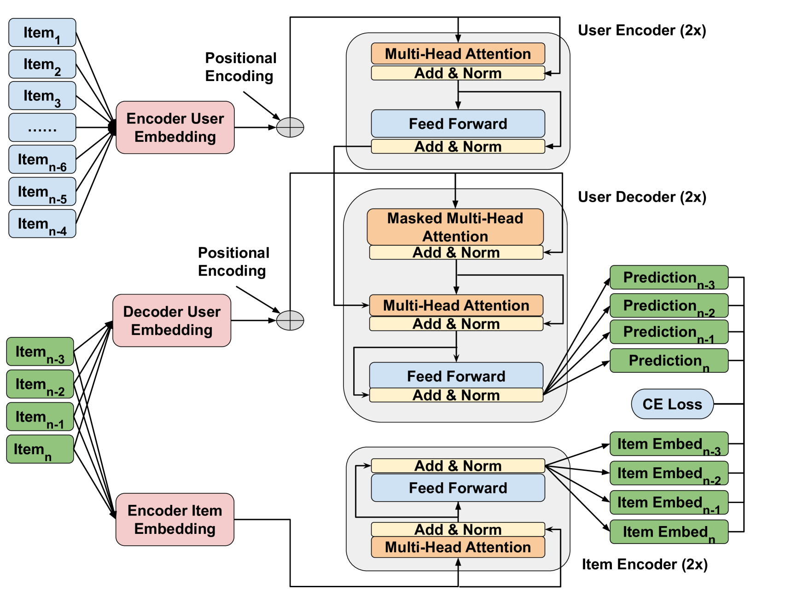

# MercaTran Implementation



This portion of the repository contains the experiment code for training Mercatran: A C2C Content Based Sequential Recommender. More details can be found in the paper [MerRec: A Large-scale Multipurpose Mercari Dataset for Consumer-to-Consumer Recommendation Systems](https://arxiv.org/abs/2402.14230) in Section 4.2.6.

## Training Evaluation

To train Mercatran on Mercari Dataset, download the dataset from [Huggingface](https://huggingface.co/datasets/mercari-us/merrec). The bechmark results reported in the paper correspond to the [first shard](https://huggingface.co/datasets/mercari-us/merrec/tree/main/20230501) of the dataset.

Install the necessary requirements.
```bash
pip install -r requirements.txt
```

Run the training and evaluation script. Note: only the data path is required. Refer to `config.py` for default parameters used in the benchmark results.

```bash
python3 main.py --data_path [path_to_the_data_shard]
```
